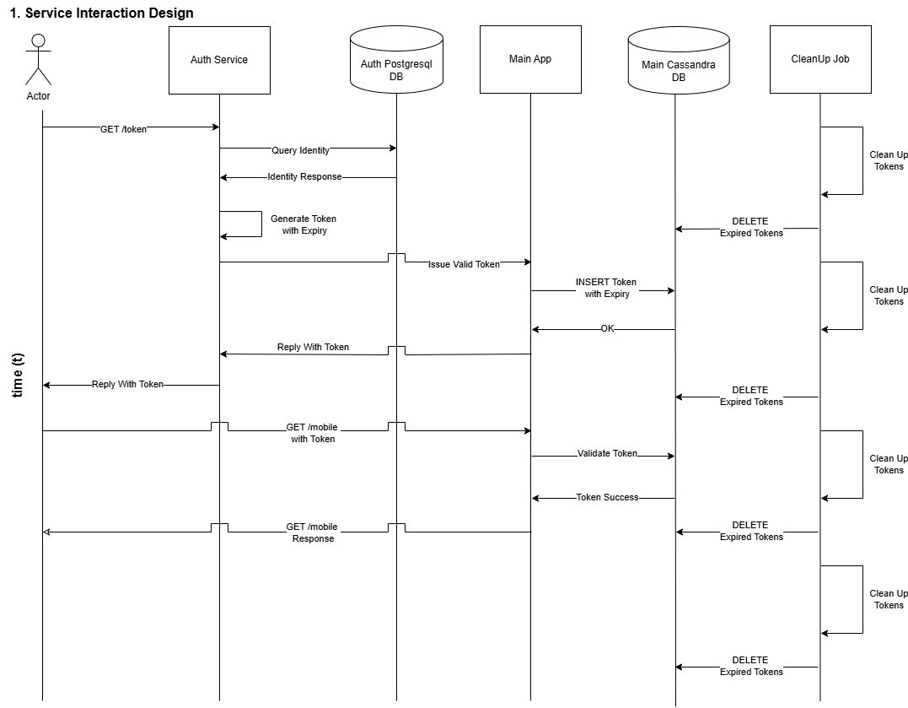

# Architecture Exercise - Service Interaction Diagram

Here is a service interaction diagram, this will hopefully form the basis of the discussion for how I understood the services and how they would interact given the tech involved. 

## Security

Immediate thoughts around security there is no identity provider or IDP. Would like to see anything in a B2C/B2B context. Okta/Auth0/AzureAD/SAML/OAuth/LDAP/PAM.

## Scalability

Not adddressed by this diagram but I highly recommend we start with the [network diagram](2-network-architecture-diagram.md) next if this is where the discussion goes next. Would keep a keen eye on folks using PM2 in the nodejs arena. Multi-processing using PANDA in python is also something to look out for. Generally folks taking on infra in code is perhaps an issue. Also implementing your own IDP needs to be considered amongst teams. 

## Maintainability

This cost of this without a proper IDP is very expensive at an enterprise level, what you trade off now, you will have to build later. It could cause a seismic shift with the long tail of migrations in the product or platform. 

## Cost Effectiveness

Although this would naively work in a stealth startup, it simply would not scale. I think it is an illusion when businesses start getting passed the scale-up phase and start pursuing postitive revenue/growth. Cost will be an issue down the line esp. with custom installations. 