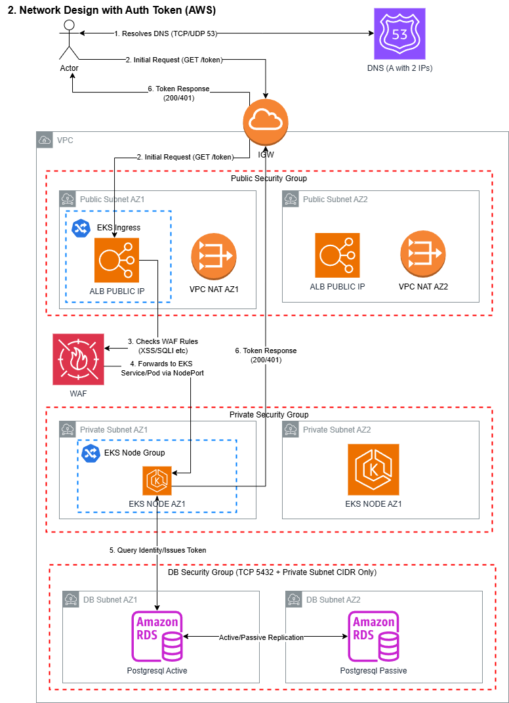

# Architecture Exercise - Network Architecture Diagram

Here is a network architecture diagram, I used AWS as an example because I feel it is my strong suite. I could do this on Azure although I feel GCP is honestly my weakspot. Just a note about return traffic, I deliberately mis-represented it for the "token reply" because it was difficult to draw lines over each other in draw.io.

## Security

This biggest glaring miss here is what do the VPC ACLs look like? Perhaps worthy of discussion. Any P2P VPN network integrations required? Certs et al. Another thing I would have liked to add is VPN access for SREs over private endpoints for the EKS/AKS/GKE control plane.  

## Scalability

I indicated kubernetes using AWS EKS, this was an assumption for sure. The cluster would have an implied autoscaling mechanism, be it autoscaler or the new untested karpenter flavour AWS are persuing via "EKS Auto Mode". I was sure to indicate that NAT gateways are zonally redundant. I was also sure to run a passive RDS instance of postgresql for cost reasons. Running an active/active hot failure over DR is totally possible, perhaps worth further discussion.  

## Maintainability

If we do this in terraform, with the right separation between ROOT modules (ie. separate infra from platform requirements), it should be highly maintainable/servicable given the org structure constraints and chain of responsibility. Less hand-offs and ticket barriers the faster this can go.

## Cost Effectiveness

This is cost prohibitive, the more you add/need the more it costs. Traffic Mirroring, hot DR sites are the things that immediately come to mind. Have not seen this in a while and it was all on-prem with banks. Worthy of discussion for sure. 