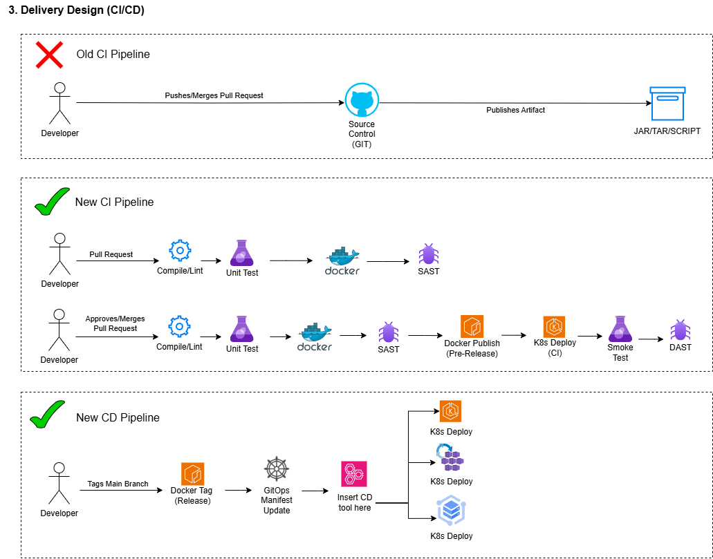

# Architecture Exercise - CI/CD Delivery Diagram

Here is a CI/CD delivery diagram, ... TODO

## Security

Developers do not need access to prod. ISO27001 or "air gapped" environments might be a consideration here. 

## Scalability

Deployments to thousands of clients around the globe can happen asynchronously "if they opt in" when signing the sales contract. 

## Maintainability

Faster feedback loops, less manual intervention. Always a fan of more testing, is the testing pyramid stale nowadays?  

## Cost Effectiveness

Depends on where the product is hosted, sometimes clients like hosting the platform themselves (ECR vs EKS). The CI part is ours, but the CD part is a hand off to the client. That could be different on a case-by-case basis. Or we could recommend? How good are our sales team?
